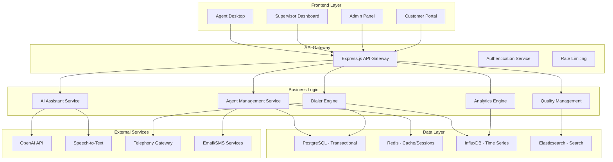
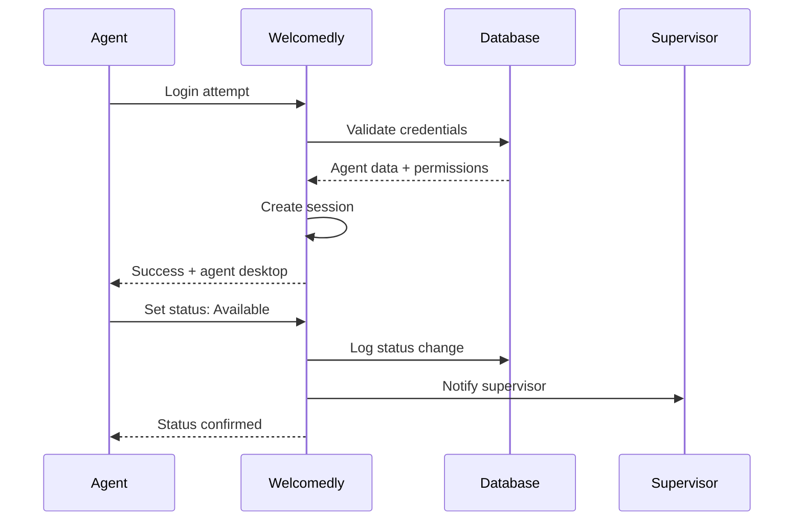
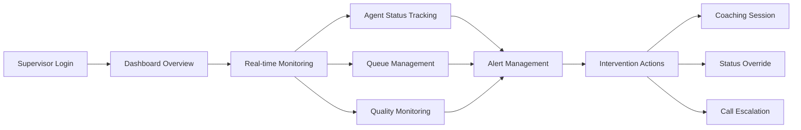
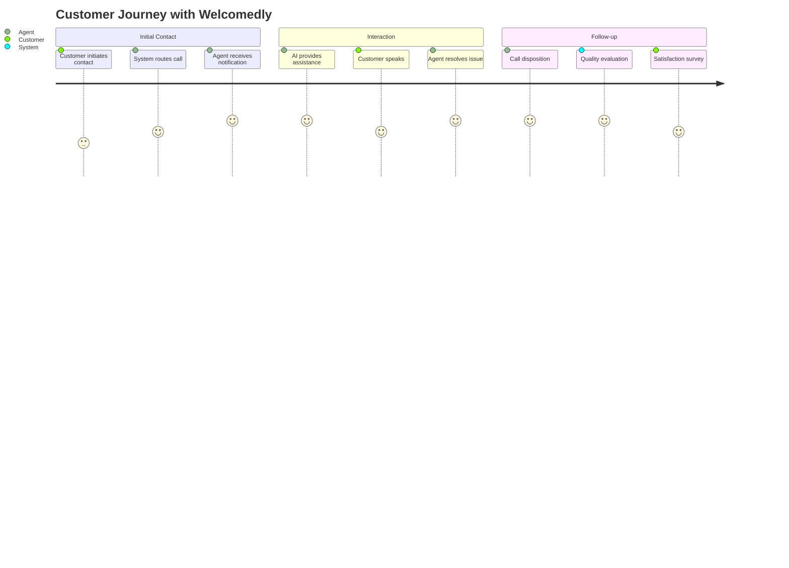

# 🚀 **MANUAL DE WELCOMEDLY - PLATAFORMA ELITE DE CONTACT CENTER**

## 📋 **TABLA DE CONTENIDO**

1. [Descripción de Welcomedly](#descripción-de-welcomedly)
2. [Objetivos Estratégicos](#objetivos-estratégicos)
3. [Funcionalidades Principales](#funcionalidades-principales)
4. [Arquitectura y Funcionamiento](#arquitectura-y-funcionamiento)
5. [Flujos de Usuario](#flujos-de-usuario)
6. [Stack Tecnológico](#stack-tecnológico)
7. [Implementación por Fases](#implementación-por-fases)

---

## 🎯 **DESCRIPCIÓN DE WELCOMEDLY**

### **¿Qué es Welcomedly?**

**Welcomedly** es una plataforma **inteligente y modular** de gestión de contact center diseñada para transformar la operativa de centros de llamadas en soluciones eficientes, productivas y centradas en el cliente.

### **Propuesta de Valor Única**

> **"Wake up your clients"** - Despierta el potencial de tus clientes con inteligencia artificial, automatización avanzada y experiencia de usuario superior.

### **Vision y Misión**

**Visión:** Convertirnos en la **plataforma líder de contact center en LATAM**, democratizando el acceso a tecnología enterprise para PYMES.

**Misión**: Empoderar a los equipos de contacto con **herramientas inteligentes** que maximicen la productividad, optimicen la experiencia del cliente y generen resultados medibles.

### **Target Market**

- **🏢 Primary**: Contact centers medianos (50-500 agentes)
- **🚀 Secondary**: Empresas LATAM implementando operaciones de contacto
- **💡 Tertiary**: Startups tecnológicas requiring scalable contact solutions

---

## 🎯 **OBJETIVOS ESTRATÉGICOS**

### **1. Objetivos de Negocio**

#### **ROI y Metricas Financieras**
- **Incremento Productividad**: 40-60% en eficiencia operativa
- **Reducción Costos**: 30% en training y calidad automatizada
- **Mejora Satisfacción**: 25% en customer experience scores
- **Optimización Conversión**: 35% en tasas de venta/retención

#### **KPIs Operacionales Clave**
```javascript
const operationalKPIs = {
    serviceLevel: {
        target: '80/20',        // 80% en 20 segundos
        industry: '60-70/30',
        competitive: '+25%'
    },
    firstCallResolution: {
        target: '85%',
        industry: '65-75%',
        competitive: '+15%'
    },
    agentUtilization: {
        target: '85%',
        industry: '70-75%',
        competitive: '+10%'
    },
    customerSatisfaction: {
        target: '4.5/5',
        industry: '3.5-4.0',
        competitive: '+0.5'
    }
};
```

### **2. Objetivos de Producto**

#### **Funcionalidades Core**
- ✅ **Workforce Engagement Management (WEM)**
- ✅ **Predictive Dialing con IA**
- ✅ **Real-time Analytics y Monitoring**
- ✅ **AI-Powered Agent Assistance**
- ✅ **Quality Management Automatizado**
- ✅ **Gamification y Engagement**

#### **Diferenciadores Competitivos**
- 🤖 **AI Latina**: Modelos entrenados para acentos y expresiones LATAM
- 💰 **Cost-Effective**: 60-70% más accesible que soluciones enterprise
- 🔧 **Modular y Extensible**: Arquitectura abierta y personalizable
- 🌎 **Regulatory Ready**: Compliance GDPR, LGPD, TCPA, PCI

### **3. Objetivos Tecnológicos**

#### **Performance y Escalabilidad**
- **Tiempo Respuesta**: <100ms para UI updates
- **Disponibilidad**: 99.9% uptime SLA
- **Escalabilidad**: Soporte 10,000+ agentes concurrentes
- **Latencia**: <50ms para voice processing

#### **Seguridad y Compliance**
- **Data Encryption**: AES-256 en reposo y tránsito
- **Access Control**: RBAC con multi-factor authentication
- **Audit Trail**: Logs completos y trazabilidad
- **Regulatory Compliance**: GDPR, LGPD, PCI-DSS

---

## 🚀 **FUNCIONALIDADES PRINCIPALES**

### **1. WORKFORCE ENGAGEMENT MANAGEMENT (WEM)**

#### **Agent Status Management**
```javascript
const agentStates = {
    AVAILABLE: 'available',           // Disponible para recibir llamadas
    IN_CALL: 'in_call',            // En llamada activa
    ON_PAUSE: 'on_pause',          // En pausa programada
    AFTER_CALL_WORK: 'acw',        // Trabajo post-llamada
    TRAINING: 'training',           // En capacitación
    MEETING: 'meeting',            // En reunión interna
    OFFLINE: 'offline'             // Desconectado
};

const pauseTypes = {
    BATHROOM: 'bathroom',         // Pausa baño (5 min max)
    LUNCH: 'lunch',              // Almuerzo (60 min max)
    BREAK: 'break',               // Pausa café (15 min max)
    COACHING: 'coaching',         // Coaching con supervisor
    SYSTEM_ISSUE: 'system',       // Problemas técnicos
    PERSONAL: 'personal'          // Asuntos personales
};
```

#### **Time Tracking y Analytics**
- **Productive Time Counter**: Segundos exactos de tiempo productivo
- **Break Management**: Control automático de tiempos de pausa
- **Attendance Tracking**: Puntualidad y horas trabajadas
- **Performance Metrics**: Métricas personalizables por agente

#### **Scheduling y Forecasting**
- **Intelligent Scheduling**: Asignación óptima basada en skills
- **Volume Forecasting**: Predicción de volúmenes con ML
- **Shift Management**: Creación y gestión de turnos
- **Overtime Control**: Control de horas extras y costos

### **2. PREDICTIVE DIALER CON IA**

#### **Advanced Dialing Modes**
```javascript
const dialingModes = {
    PREDICTIVE: 'predictive',      // Marcación predictiva con IA
    POWER: 'power',               // Marcación power (multiple lines)
    PROGRESSIVE: 'progressive',    // Marcación progresiva (1:1 ratio)
    PREVIEW: 'preview',           // Preview dialing con información
    MANUAL: 'manual'             // Marcación manual tradicional
};

const dialingFeatures = {
    answerMachineDetection: {
        accuracy: '99.2%',
        technology: 'AI-powered voice analysis',
        features: ['amd', 'voicemail detection', 'fax detection']
    },
    callBlending: {
        outboundInbound: true,
        priorityRouting: true,
        skillBasedRouting: true
    },
    complianceManagement: {
        tcpaCompliance: true,
        dncListManagement: true,
        callTimeRestrictions: true,
        consentManagement: true
    }
};
```

#### **Intelligent Call Distribution**
- **Skill-Based Routing**: Asignación por competencias específicas
- **Priority Queue Management**: Gestión inteligente de colas
- **Load Balancing**: Distribución óptima de llamadas
- **Real-time Monitoring**: Supervisión en tiempo real

### **3. AI-POWERED AGENT ASSISTANCE**

#### **Real-time AI Coach**
```javascript
class AIAssistant {
    capabilities = {
        responseSuggestions: {
            context: 'Customer conversation history',
            emotion: 'Sentiment analysis',
            intent: 'Customer intent detection',
            recommendations: 'Next best actions'
        },
        knowledgeSearch: {
            semantic: 'Natural language understanding',
            database: 'Product/service knowledge base',
            indexing: 'Vector search embeddings',
            retrieval: 'RAG (Retrieval Augmented Generation)'
        },
        complianceGuidance: {
            scripts: 'Dynamic script adjustment',
            monitoring: 'Real-time compliance checking',
            alerts: 'Potential violation warnings',
            guidance: 'Corrective suggestions'
        }
    };
}
```

#### **Speech Analytics**
- **Real-time Transcription**: Conversión voz a texto en vivo
- **Sentiment Analysis**: Análisis emocional continuo
- **Keyword Detection**: Detección automática de palabras clave
- **Topic Modeling**: Clasificación automática de temas
- **Compliance Monitoring**: Validación en tiempo real de normativas

### **4. QUALITY MANAGEMENT**

#### **Automated Quality Scoring**
```javascript
const qualityScoring = {
    empathyScore: {
        weight: 25,
        metrics: ['tone_analysis', 'emotional_intelligence', 'active_listening']
    },
    resolutionScore: {
        weight: 30,
        metrics: ['problem_solving', 'first_call_resolution', 'customer_satisfaction']
    },
    efficiencyScore: {
        weight: 25,
        metrics: ['average_handling_time', 'call_flow_optimization', 'tool_usage']
    },
    complianceScore: {
        weight: 20,
        metrics: ['script_adherence', 'regulatory_compliance', 'data_protection']
    }
};
```

#### **Call Recording y Storage**
- **Selective Recording**: Grabación inteligente basada en reglas
- **Encryption Storage**: Encriptación de grado militar
- **RetentionPolicy**: Políticas automatizadas de retención
- **ArchiveManagement**: Gestión avanzada de archivos

### **5. REAL-TIME ANALYTICS**

#### **Executive Dashboard**
```javascript
const executiveMetrics = {
    operationalKPIs: [
        'service_level',
        'abandonment_rate',
        'average_handling_time',
        'first_call_resolution',
        'agent_utilization'
    ],
    financialMetrics: [
        'revenue_per_hour',
        'cost_per_contact',
        'conversion_rate',
        'customer_lifetime_value',
        'roi_analysis'
    ],
    qualityMetrics: [
        'customer_satisfaction',
        'net_promoter_score',
        'quality_assurance_score',
        'compliance_rate',
        'agent_performance_index'
    ]
};
```

#### **Advanced Visualizations**
- **Real-time Wallboards**: Métricas en pantallas grandes
- **Trend Analysis**: Análisis de tendencias históricas
- **Comparative Analytics**: Benchmarking interno y externo
- **Predictive Insights**: Proyecciones y recomendaciones

### **6. GAMIFICATION Y ENGAGEMENT**

#### **Motivation System**
```javascript
const gamificationSystem = {
    achievements: {
        salesChampion: 'First 10 sales in a day',
        qualityExpert: '95%+ quality score',
        customerHero: 'Top customer satisfaction',
        efficiencyMaster: 'Best AHT optimization',
        teamPlayer: 'Best collaborative performance'
    },
    leaderboards: {
        daily: 'Daily performance ranking',
        weekly: 'Weekly cumulative results',
        monthly: 'Monthly achievement champions',
        quarterly: 'Quarterly performance awards'
    },
    rewards: {
        points: 'Earned through performance',
        badges: 'Visual recognition of achievements',
        levels: 'Progressive skill advancement',
        prizes: 'Tangible rewards for top performers'
    }
};
```

---

## 🏗️ **ARQUITECTURA Y FUNCIONAMIENTO**

### **1. ARQUITECTURA GENERAL**



### **2. MICROSERVICES ARCHITECTURE**

#### **Agent Management Service**
```javascript
class AgentService {
    constructor() {
        this.database = new AgentRepository();
        this.cache = new RedisCache();
        this.eventBus = new EventBus();
    }

    async updateAgentStatus(agentId, status, metadata = {}) {
        // Validar transición de estado
        const validTransition = this.validateStatusTransition(agentId, status);
        if (!validTransition) {
            throw new Error('Invalid status transition');
        }

        // Actualizar base de datos
        const updatedAgent = await this.database.updateStatus(agentId, status, metadata);

        // Emitir evento en tiempo real
        this.eventBus.emit('agent:status:change', {
            agentId,
            previousStatus: updatedAgent.previousStatus,
            newStatus: status,
            timestamp: new Date(),
            metadata
        });

        // Actualizar cache
        await this.cache.set(`agent:${agentId}:status`, status, 300);

        return updatedAgent;
    }
}
```

#### **Dialer Engine**
```javascript
class PredictiveDialer {
    constructor() {
        this.callQueue = new PriorityQueue();
        this.agentPool = new AgentManager();
        this.analytics = new DialerAnalytics();
        this.aiModel = new AnsweringMachineDetector();
    }

    async optimizeCallingRatio() {
        const metrics = await this.analytics.getRealTimeMetrics();

        // Machine Learning para optimal ratio
        const optimalRatio = await this.mlModel.predict({
            abandonmentRate: metrics.abandonment,
            averageTalkTime: metrics.talkTime,
            agentCount: metrics.availableAgents,
            answerRate: metrics.answerRate
        });

        return optimalRatio;
    }

    async detectAnsweringMachine(audioStream) {
        const features = this.extractAudioFeatures(audioStream);
        const prediction = await this.aiModel.predict(features);

        return {
            isMachine: prediction.confidence > 0.95,
            confidence: prediction.confidence,
            reason: prediction.reasoning
        };
    }
}
```

### **3. REAL-TIME COMMUNICATION**

#### **WebSocket Event System**
```javascript
const socketEvents = {
    // Agent Events
    'agent:status:change': 'Cambio de estado del agente',
    'agent:pause:start': 'Inicio de pausa',
    'agent:pause:end': 'Fin de pausa',
    'agent:call:start': 'Inicio de llamada',
    'agent:call:end': 'Fin de llamada',

    // Supervisor Events
    'supervisor:monitor': 'Monitoreo supervisor',
    'supervisor:alert': 'Alerta crítica',
    'supervisor:quality:alert': 'Alerta de calidad',

    // Campaign Events
    'campaign:metrics:update': 'Actualización métricas campaña',
    'campaign:queue:status': 'Estado cola campaña',

    // System Events
    'system:notification': 'Notificaciones sistema',
    'system:maintenance': 'Mantenimiento programado'
};
```

---

## 👥 **FLUJOS DE USUARIO**

### **1. FLUJO DEL AGENTE**

#### **Inicio de Sesión**


#### **Manejo de Llamadas Típico**
```javascript
// Flujo completo de llamada
class CallWorkflow {
    async handleIncomingCall(agentId, callData) {
        try {
            // 1. Asignar llamada al agente
            const call = await this.assignCall(agentId, callData);

            // 2. Actualizar estado del agente
            await this.updateAgentStatus(agentId, 'IN_CALL', {
                callId: call.id,
                customerInfo: call.customer
            });

            // 3. Mostrar información del cliente
            this.displayCustomerInfo(agentId, call.customer);

            // 4. Iniciar AI Assistant
            await this.startAIAssistant(agentId, call);

            // 5. Iniciar transcripción y análisis
            await this.startSpeechAnalytics(call.id);

            // 6. Esperar finalización de llamada
            this.waitForCallEnd(call.id);

        } catch (error) {
            console.error('Call handling error:', error);
            await this.handleCallError(agentId, error);
        }
    }
}
```

#### **Gestión de Pausas**
```javascript
class PauseManagement {
    async requestPause(agentId, pauseType, reason = '') {
        // Validar reglas de pausa
        const validation = await this.validatePauseRequest(agentId, pauseType);
        if (!validation.valid) {
            throw new Error(validation.reason);
        }

        // Iniciar pausa
        const pause = await this.startPause(agentId, pauseType, reason);

        // Notificar supervisor
        await this.notifySupervisorPauseStart(agentId, pause);

        // Iniciar timer
        this.startPauseTimer(agentId);

        return pause;
    }

    async endPause(agentId) {
        const pause = await this.getActivePause(agentId);
        if (!pause) return;

        // Finalizar pausa
        const endedPause = await this.completePause(agentId, pause.id);

        // Actualizar estado a disponible
        await this.setAgentAvailable(agentId);

        // Notificar supervisor
        await this.notifySupervisorPauseEnd(agentId, endedPause);

        return endedPause;
    }
}
```

### **2. FLUJO DEL SUPERVISOR**

#### **Monitoreo en Tiempo Real**


#### **Intervenciones Proactivas**
```javascript
class SupervisorIntervention {
    async detectNeedForIntervention() {
        const triggers = await this.analyzeRealTimeMetrics();

        for (const trigger of triggers) {
            switch (trigger.type) {
                case 'long_pause':
                    await this.handleLongPause(trigger.agentId);
                    break;
                case 'low_quality':
                    await this.handleQualityIssue(trigger.agentId, trigger.callId);
                    break;
                case 'high_abandonment':
                    await this.handleQueueOverflow(trigger.queueId);
                    break;
                case 'agent_distress':
                    await this.handleAgentAssistance(trigger.agentId);
                    break;
            }
        }
    }

    async startCoachingSession(agentId, type = 'text') {
        if (type === 'audio') {
            // Whisper coaching para no interrumpir llamada
            await this.startWhisperCoaching(agentId);
        } else {
            // Chat coaching
            await this.startTextCoaching(agentId);
        }

        // Log intervención
        await this.logIntervention(agentId, 'coaching', type);
    }
}
```

### **3. FLUJO DEL ADMINISTRADOR**

#### **Configuración de Sistema**
```javascript
class SystemConfiguration {
    async configureCampaign(campaignConfig) {
        // Validar configuración
        const validation = await this.validateCampaignConfig(campaignConfig);
        if (!validation.valid) {
            throw new Error(validation.errors.join(', '));
        }

        // Crear campaña
        const campaign = await this.createCampaign(campaignConfig);

        // Configurar dialer parameters
        await this.configureDialer(campaign.id, campaignConfig.dialing);

        // Asignar agentes
        await this.assignAgents(campaign.id, campaignConfig.agents);

        // Configurar disposiciones
        await this.configureDispositions(campaign.id, campaignConfig.dispositions);

        // Activar campaña
        await this.activateCampaign(campaign.id);

        return campaign;
    }
}
```

### **4. FLUJO DEL CLIENTE**

#### **Customer Journey**


---

## 💻 **STACK TECNOLÓGICO**

### **1. BACKEND STACK**

#### **Core Technologies**
```javascript
const backendStack = {
    runtime: {
        primary: 'Node.js 18+ LTS',
        modules: 'ES Modules',
        types: 'TypeScript 5.0+'
    },
    webFramework: {
        main: 'Express.js 5.0',
        middleware: 'Helmet, CORS, Morgan',
        validation: 'Joi, Express-validator'
    },
    databases: {
        relational: 'PostgreSQL 15+',
        cache: 'Redis 7+',
        timeSeries: 'InfluxDB 2.0',
        search: 'Elasticsearch 8.x'
    },
    realTime: {
        websockets: 'Socket.io 4.x',
        messaging: 'Redis Pub/Sub',
        streaming: 'Apache Kafka (optional)'
    }
};
```

#### **AI/ML Technologies**
```javascript
const aiStack = {
    languageModels: {
        primary: 'OpenAI GPT-4',
        fallback: 'Google Gemini',
        local: 'Ollama for on-prem'
    },
    speechProcessing: {
        speechToText: 'Google Cloud Speech API',
        textToSpeech: 'Amazon Polly',
        analysis: 'Assembly.ai, Deepgram'
    },
    machineLearning: {
        framework: 'TensorFlow.js, scikit-learn',
        deployment: 'Docker, Kubernetes',
        monitoring: 'MLflow, Weights & Biases'
    }
};
```

### **2. FRONTEND STACK**

#### **Modern Web Technologies**
```javascript
const frontendStack = {
    framework: {
        primary: 'React 18+',
        stateManagement: 'Redux Toolkit, Zustand',
        routing: 'React Router 6'
    },
    styling: {
        cssFramework: 'Bootstrap 5 + Custom SASS',
        designSystem: 'Material-UI components',
        responsive: 'Mobile-first approach'
    },
    realTime: {
        client: 'Socket.io-client',
        stateSync: 'React Query, SWR',
        optimistic: 'Immediate UI updates'
    },
    visualization: {
        charts: 'D3.js, Chart.js',
        dashboards: 'Grafana embed',
        maps: 'Leaflet, Mapbox'
    }
};
```

### **3. DEVOPS Y INFRAESTRUCTURA**

#### **Containerización y Orchestration**
```yaml
# docker-compose.yml
version: '3.8'
services:
  app:
    build: .
    ports:
      - "3000:3000"
    environment:
      - NODE_ENV=production
      - DATABASE_URL=postgresql://user:pass@db:5432/welcomedly
    depends_on:
      - db
      - redis

  db:
    image: postgres:15
    volumes:
      - postgres_data:/var/lib/postgresql/data
    environment:
      POSTGRES_DB: welcomedly
      POSTGRES_USER: postgres
      POSTGRES_PASSWORD: ${DB_PASSWORD}

  redis:
    image: redis:7-alpine
    command: redis-server --appendonly yes
    volumes:
      - redis_data:/data

  nginx:
    image: nginx:alpine
    ports:
      - "80:80"
      - "443:443"
    volumes:
      - ./nginx.conf:/etc/nginx/nginx.conf
      - ./ssl:/etc/ssl/certs
    depends_on:
      - app
```

#### **Monitoring y Observability**
```javascript
const monitoringStack = {
    applicationMonitoring: {
        apm: 'New Relic, Datadog',
        logging: 'Winston, ELK Stack',
        errorTracking: 'Sentry'
    },
    infrastructureMonitoring: {
        metrics: 'Prometheus, Grafana',
        uptime: 'UptimeRobot, Pingdom',
        alerts: 'PagerDuty, Opsgenie'
    },
    securityMonitoring: {
        scanning: 'OWASP ZAP, Nessus',
        siem: 'Splunk, QRadar',
        compliance: 'AWS Security Hub'
    }
};
```

---

## 🚀 **IMPLEMENTACIÓN POR FASES**

### **ROADMAP ESTRATÉGICO 8-SEMANAS**

#### **FASE 1: FUNDAMENTOS OPERATIVOS (Semanas 1-2)**
- ✅ Agent Status Management
- ✅ Time Tracking System
- ✅ Pause Management
- ✅ Basic Real-time Communication
- ✅ Supervisor Monitoring Dashboard

#### **FASE 2: IA Y PRODUCTIVIDAD (Semanas 3-4)**
- ✅ AI Assistant Implementation
- ✅ Speech Analytics Basic
- ✅ Predictive Dialer Core
- ✅ Quality Management Foundation
- ✅ Knowledge Base Integration

#### **FASE 3: ANALYTICS AVANZADO (Semanas 5-6)**
- ✅ Real-time Analytics Dashboard
- ✅ Executive Reporting
- ✅ Predictive Analytics
- ✅ Gamification System
- ✅ Mobile Responsive Interface

#### **FASE 4: ENTERPRISE FEATURES (Semanas 7-8)**
- ✅ Multi-tenant Support
- ✅ Advanced Security Features
- ✅ Compliance Management
- ✅ API Ecosystem
- ✅ Performance Optimization

---

## 📊 **KPIs Y MÉTRICAS DE ÉXITO**

### **Operational KPIs**
- **Service Level**: 80/20 (80% calls answered in 20 seconds)
- **First Call Resolution**: >85%
- **Average Handling Time**: <180 seconds
- **Agent Utilization**: >85%
- **Customer Satisfaction**: >4.5/5

### **Financial KPIs**
- **Revenue per Hour**: Baseline +35%
- **Cost per Contact**: Baseline -30%
- **Conversion Rate**: Baseline +40%
- **Customer Lifetime Value**: Baseline +25%
- **Return on Investment**: >300% first year

### **Quality KPIs**
- **Compliance Score**: >95%
- **Quality Assurance Score**: >90%
- **Agent Performance Index**: >8/10
- **Customer Effort Score**: <2/5
- **Net Promoter Score**: >70

---

## 🔮 **VISIÓN A FUTURO**

### **Roadmap 12-18 Meses**
- **Voice Biometrics**: Autenticación por voz
- **Predictive Customer Intelligence**: Anticipación de necesidades
- **Augmented Reality Assistance**: AR para coaching de agentes
- **Blockchain Compliance**: Validación inmutable de compliance
- **Quantum Computing**: Optimización avanzada de routing

### **Expansión Geográfica**
- **Phase 1**: México, Colombia, Perú (Q1 2025)
- **Phase 2**: Brasil, Argentina, Chile (Q2 2025)
- **Phase 3**: Centroamérica, Caribe (Q3 2025)
- **Phase 4**: Expansion to US Hispanic market (Q4 2025)

---

## 📞 **SOPORTE Y MANTENIMIENTO**

### **Niveles de Soporte**
- **Bronze**: Email support, 48h response
- **Silver**: Priority support, 24h response, phone support
- **Gold**: Dedicated account manager, 4h response, on-site support
- **Platinum**: 24/7 support, custom SLAs, proactive monitoring

### **Mantenimiento Programado**
- **Actualizaciones**: Quincenales con hotfixes según necesidad
- **Backup**: Diario con retención 30 días
- **Disaster Recovery**: RTO < 1 hora, RPO < 15 minutos
- **Performance Monitoring**: Continuo con alertas automáticas

---

## 🎯 **CONCLUSIÓN**

**Welcomedly representa el futuro del contact center en LATAM**, combinando tecnología enterprise con accesibilidad económica, flexibilidad modular y enfoque regional optimizado.

**Nuestro compromiso es transformar cada interacción en una oportunidad**, cada agente en un performer elite y cada contacto center en un motor de crecimiento sostenible.

**¡Juntos despertaremos el potencial ilimitado de tus clientes!** 🚀

---

*Este manual es un documento vivo que evoluciona con el producto y las necesidades del mercado.*